  <!-- 1. GIF do Terminal -->
  
    

  <!-- 2. Badges: LinkedIn e Contador de Visitas -->
  
  &nbsp;
  

---

### 👨‍💻 Sobre mim
- 🔭 Atualmente trabalhando em projetos de portfólio focados em bancos de dados relacionais, **usando SQL, Python e Power BI.**

- 🌱 Estudando sempre mais sobre **Python, Ciência de Dados, BI e visualização de dados estruturados.**

- 🎯 Meu objetivo é conseguir minha primeira vaga como **Analista de Dados** no setor bancário ou em grandes empresas, e crescer resolvendo problemas reais com tecnologia.

---

### 🛠️ Tecnologias e Ferramentas

  
  
  
  
  
  
  
  
   
  
   

---

### 📊 Minhas Estatísticas

  
  

---

### 🐍 Contribuições

  <picture>
    <source media="(prefers-color-scheme: dark)" srcset="https://raw.githubusercontent.com/christianwislockioli-rgb/christianwislockioli-rgb/output/github-contribution-grid-snake-dark.svg">
    <source media="(prefers-color-scheme: light)" srcset="https://raw.githubusercontent.com/christianwislockioli-rgb/christianwislockioli-rgb/output/github-contribution-grid-snake.svg">
    
